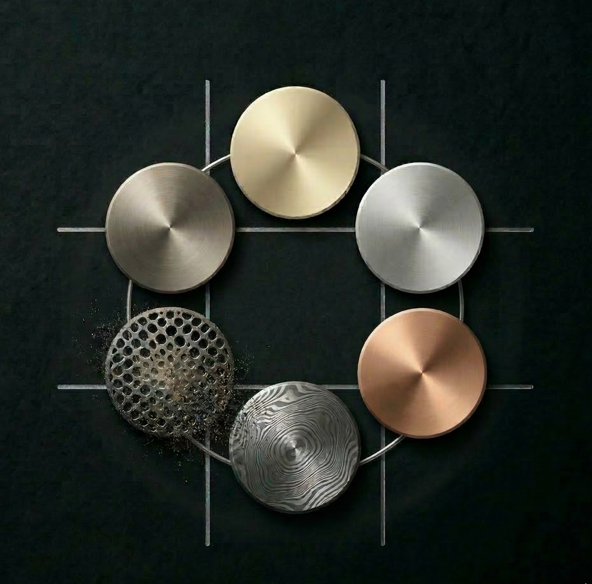

#  Tic-Tac-Flow

Tic-Tac-Flow is a high-performance, strategic reimagining of the traditional Tic-Tac-Toe framework. Developed with a sophisticated "Sci-Fi Lux" aesthetic, the application introduces the proprietary Flow Mechanic—a dynamic system where the board state is continuous, necessitating advanced tactical foresight.

**Note on Design:** All visual assets, UI/UX components, and branding elements were custom-architected and designed in **Figma** specifically for this project to ensure a unique, premium user experience.

---

## Technical Stack

| Category | Technology | Logo |
| :--- | :--- | :--- |
| **Frontend** | React 18 |  |
| **Build Tool** | Vite |  |
| **Animation** | Framer Motion |  |
| **Styling** | CSS3 |  |
| **Backend** | FastAPI |  |
| **Design** | Figma |  |

---

## Core Architecture and Mechanics

### The Flow Mechanic
Traditional grid-based games often reach a static terminal state. Tic-Tac-Flow resolves this through a continuous displacement system:
*   **Board Capacity:** The operational environment supports a maximum of six active units.
*   **Chronological Displacement:** Placement of a seventh unit triggers the immediate removal of the oldest unit on the grid.
*   **Visual Indicators:** Units approaching expiration utilize localized opacity transitions to signal imminent state changes.

### Interface Excellence
*   **Custom Figma Design:** Every interface element, from the glassmorphism grid to the metallic disc textures, was handcrafted in Figma to establish a cohesive high-end identity.
*   **Modular Component Design:** Optimized React components ensuring high-frequency state updates without performance degradation.
*   **Premium Visual Assets:** A curated gallery of high-resolution textures including metallic, matte, and luminescence-based finishes.

---

## Artificial Intelligence Registry

The Solo Mode features six distinct AI entities, each governed by specialized decision-making algorithms:

| Entity | Classification | Strategic Archetype | Logic Implementation |
| :--- | :--- | :--- | :--- |
| **Austin** | Novice | *The Learner* | Stochastic move selection based on available grid indices. |
| **Fabio** | Inedit | *The Stylist* | Weighted heuristic favoring geometric symmetry over direct optimization. |
| **Mira** | Adaptive | *The Mirror* | Central symmetry replication with dynamic threat response. |
| **Anisia** | Advanced | *The Defender* | High-priority blocking logic integrated with Flow-awareness. |
| **Mark** | Master | *The Architect* | Deep-search Minimax algorithm for calculated positional dominance. |
| **Toby** | Himself | *The Grandmaster* | **Flow-Aware Minimax** utilizing alpha-beta pruning and future-state removal simulation. |

---

## Operational Modes

### Current Implementation (Client-Side Authoritative)
*   **Local PvP:** Localized multiplayer support with independent asset customization for both participants.
*   **Solo Engagement:** Complete integration with the six-tier AI registry and bot-specific identifiers.
*   **Asset Gallery:** Access to twelve distinct high-resolution unit textures.

### Development Roadmap (Server-Side Integration)
The current architecture is prepared for the deployment of the following features:
*   **Synchronized Online PvP:** Real-time state synchronization via WebSocket protocols.
*   **Competitive Ranking:** Global leaderboards for high-tier difficulty completions.
*   **Cloud Persistence:** User profiles with synchronized statistics and unlocked aesthetic assets.

---

## Installation and Deployment

1.  **Repository Initialization:** Clone the project to local environment.
2.  **Frontend Deployment:**
    ```bash
    cd frontend
    npm install
    npm run dev
    ```
3.  **Backend Initialization (Technical Preview):**
    ```bash
    cd backend
    pip install -r requirements.txt
    uvicorn app.main:app --reload
    ```

---

*Engineered for strategic depth and visual precision. Designed in Figma.*
